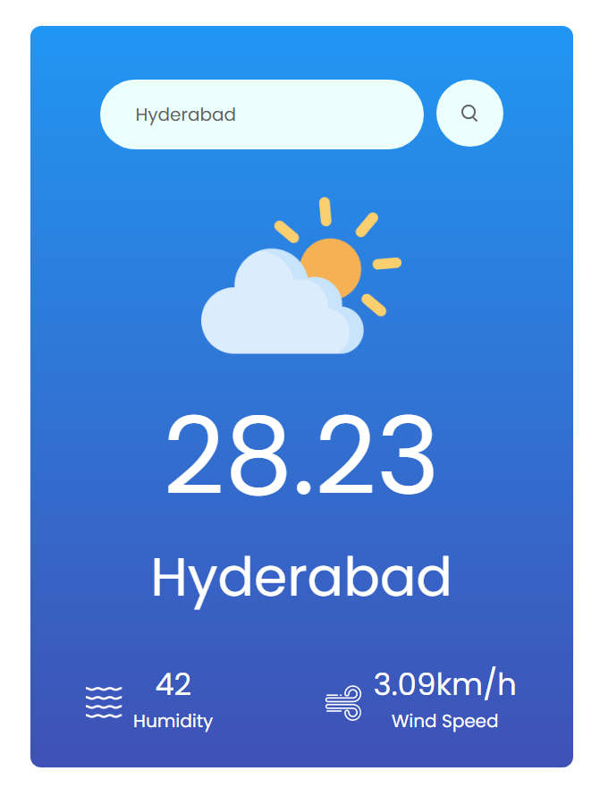

# Weather App

Welcome to the Weather App! This is a simple React application that allows users to check the current weather conditions for a specific city.

## Features

- Enter the name of a city to retrieve its current weather information.
- View temperature, humidity, and wind speed for the selected city.
- Error handling for invalid city names.

## How to Use

1. Clone this repository to your local machine.
2. Install dependencies by running `npm install` in the project directory.
3. Obtain an API key from [OpenWeatherMap](https://openweathermap.org/) and replace the `apiKey` variable in `App.js` with your API key.
4. Run the application using `npm start`.
5. Enter the name of a city in the input field and click the search icon to view its weather information.

## Technologies Used

- React
- HTML/CSS
- OpenWeatherMap API

## Screenshots

## Contributing

Contributions are welcome! If you have any suggestions or improvements, please open an issue or create a pull request.

## License

This project is licensed under the [MIT License](LICENSE).

